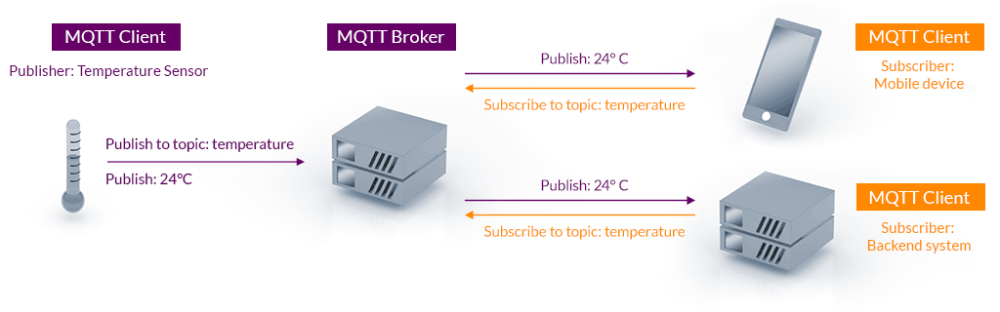

MQTT es un protocolo de mesajeria dedicada para el Internet de las Cosas (IoT). Es esta diseñado como  un transporte de mensajerrica por **publish/subscribe ligero** que es ideal para conectar dispositivos remotos con:

1. Poco *code footprint* (Poco tamaño de mensaje). 
2. Con un minimo ancho de banda.

**MQTT** es usado en muchas aplicaciones de la industria, manufactura, telecomunicaciones entre otras.

## Ventajas de MQTT

- Ligero y Eficiente
- Comunicaciones Bidireccionales: Dispositivo a la nube y de la nube al dispositivo.
- Escalable a cientos de cosas
- Mensajeria Segura
- Soporte para Redes que no tienen confiabilidad
- Permite seguridad (Encriptación).

## Arquitectura Publish/Subcribe de MQTT

El modelo **Pub/Sub** de MQTT, un nodo puede subscribirse a un canal para recibir cierta información y puedo publicar en este canal.

El protocolo MQTT corre encima del protocolo TCP/IP. Otro procolo que utiliza el pub/sub es el websockets y es una comunicación full-duplex, y esta coneción se realice por medio de handshake.

