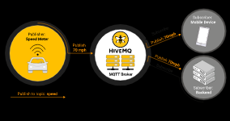

MQTT es un protocolo de mesajeria dedicada para el Internet de las Cosas (IoT). Es esta diseñado como  un transporte de mensajerrica por **publish/subscribe ligero** que es ideal para conectar dispositivos remotos con:

1. Poco *code footprint* (Poco tamaño de mensaje). 
2. Con un minimo ancho de banda.

> MQTT significa *MQ Telemetry Transport*.

**MQTT** es usado en muchas aplicaciones de la industria, manufactura, telecomunicaciones entre otras.

## Ventajas de MQTT

- Ligero y Eficiente
- Comunicaciones Bidireccionales: Dispositivo a la nube y de la nube al dispositivo.
- Escalable a cientos de cosas
- Mensajeria Segura
- Soporte para Redes que no tienen confiabilidad
- Permite seguridad (Encriptación).

## Arquitectura Publish/Subcribe de MQTT

El modelo **Pub/Sub** de MQTT, un nodo puede subscribirse a un canal para recibir cierta información y puedo publicar en este canal.

El protocolo MQTT corre encima del protocolo TCP/IP. Otro procolo que utiliza el pub/sub es el websockets y es una comunicación full-duplex, y esta coneción se realice por medio de handshake.

Este protocolo es un conjunto de reglas que definen como los dispositivos pueden publicar y subscribirse a los datos sobre el internet. Este procolo es un **conductor de eventos** y conecta dispositivos que usan patrones de Pub/Sub.

La emisor (Publisher) y el recepetor (Subscriber) se comunican via **topics** (topicos) y son desacoplados de cada otro.

La conexión entre ellos es resuelta por un **MQTT broker**, este filtrara todos los mensajes y los distribuira correctamente a los subscriptores.

**Basic Concepts**
1. publish/subscribe
2. client/broker

**Basic Functionality**
1. Connect
2. Publish
3. Subscribe

**Feactures**
1. Quality of Service
2. Retained Messages
3. Persistent Session
4. Last Will and Testament
5. Keep Alive
6. MQTT over WebSockets

## Introducción
> MQTT es un protocolo de transporte de mensajes basado en Pub/Sub, viales para comunicaciones M2M (Machine to Machine) y IoT (Internet de las Cosas) donde se necesite:

- Poco codigo *footprint*
- Ancho de Banda Limitado

[Documentación Oficial](https://docs.oasis-open.org/mqtt/mqtt/v3.1.1/mqtt-v3.1.1.html)

- Otra caracteristica que tiene MQTT es que es un **protocolo binario**, debido a que tiene una minima sobrecarga de paquetes, por lo que es ideal para la transferencia de datos sobre el cable en comparación al protocolo HTTP. 

- MQTT es facil de implementar del lado del cliente, y su construcción sobre dispositivos con recursos limitados.

### Un poco de historia
Inventado en el 99' por IBMY y Arcom, se desarrollo para comunicaciones con baja costo de bateria y ancho de banda limitado, este se usaba para conectar oleoductos via satelite. Con el tiempo el propietario del protocolo lo puso abierto para el uso de aplicaciones IoT. *MQ* se refiere a la serie MQ de productoss de IBM. 
En el 2010 IBM libera la version MQTT 3.

### Patron Pub/Sub de MQTT
El patron de MQTT Publish/Subscribe provee una alternativa para la arquitectura tradicional cliente-servidor. En el modelo cliente-servidor, un cliente se comunica directamente con un endpoint. Mientras que **el modelo pub/sub desacopla al cliente que envia un mensaje (el publicador) de el cliente o los clientes que reciben los mensajes (los subscriptores)**. Asi el publicador y el subscriptor nunca tienen contacto, inclusive ellos se pueden encontrar en diferentes existencias. **La coneccion entre ellos es resuelta por un tercer componente llamado broker**. 
El trabajo del **broker** es la  **filtración de todos los mensajes  entrantes** y **distribuirlos** entre ellos.

Se recuerda que **el aspecto mas importante es el desacople del publicador del mensaje y el subscriptor**. 

El desacople de las dimensiones tiene que ser:

- **Desacople en espacio**: Publicador y subcriptor no necesitan concerce entre ellos (por ejemplo, no intercambian IP o puerto).
- **Desacople de tiempo**: El Publicador y el subscriptor no necesita correr en el mismo tiempo.
- **Desacople por sincronización**: Las operaciones sobre ambos componentes no necesitan ser interrumpidos durante la publicanción y la recepción.

#### Resumen
En resumen, la **Arquitectura o modelo MQTT pub/sub** elimina la comunicación directa entre el publicador de el mensaje y el receptor/subcriptor. **La actividad de filtración de el broker** que  esto sea posible, a traves del control de mensajes que se envian a los cliente/subscriptor. Y el desacople tiene tres dimensiones: en espacio, tiempo y sincronización.

